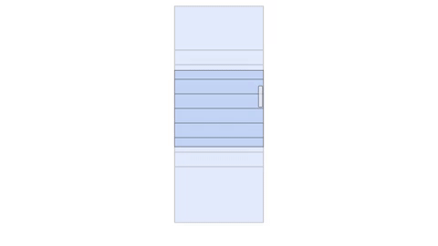

## Virtual Scroll Sample (React virtualized)

As we all know when the web browser downloads a large amount of data to display (eg 10000 records) it will be very slow, sluggish, low performance affects quite a lot of user experience (UX).

That's why people have created an improved method that is virtual scroll, which only renders parts of the user's view point. Instead of displaying all 10000 HTML elements, just display more than a dozen elements.

When we scroll, some elements will be removed from the DOM for optimization and the resulting scrollbar is a virtual scrollbar. So no matter how much data we display, the application will still be smooth :))


Illustration:



## SETTING

    npm install

## USE

    npm start

Example code using react virtualized to display a list list of up to 10000 elements:

```javascript
const rowCount = 10000;
const rowHeight = 50;
const listHeight = 500;

const App = () => {
  const list = Array(rowCount)
    .fill()
    .map((val, idx) => {
      return {
        id: idx,
        image: "http://via.placeholder.com/40",
        text: loremIpsum({
          count: 1,
          units: "sentences",
          sentenceLowerBound: 4,
          sentenceUpperBound: 8,
        }),
      };
    });

  const renderRow = ({ index, key, style }) => {
    return (
      <div key={key} style={style} className="row-list">
        <div className="image">
          
        </div>
        <div className="content">
          <div>ID: {list[index].id}</div>
          <div>{list[index].text}</div>
        </div>
      </div>
    );
  };

  return (
    <div className="App">
      <AutoSizer disableWidth>
        {() => {
          return (
            <div>
              <div>
                <List
                  width={800}
                  height={listHeight}
                  rowHeight={rowHeight}
                  rowRenderer={renderRow}
                  rowCount={list.length}
                  overscanRowCount={3}
                  style={{ borderBottom: "1px solid #eee" }}
                />
              </div>
            </div>
          );
        }}
      </AutoSizer>
    </div>
  );
};
export default App;

```